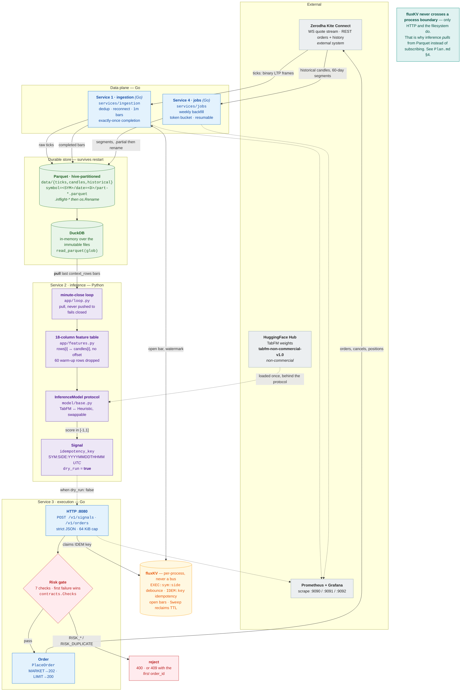
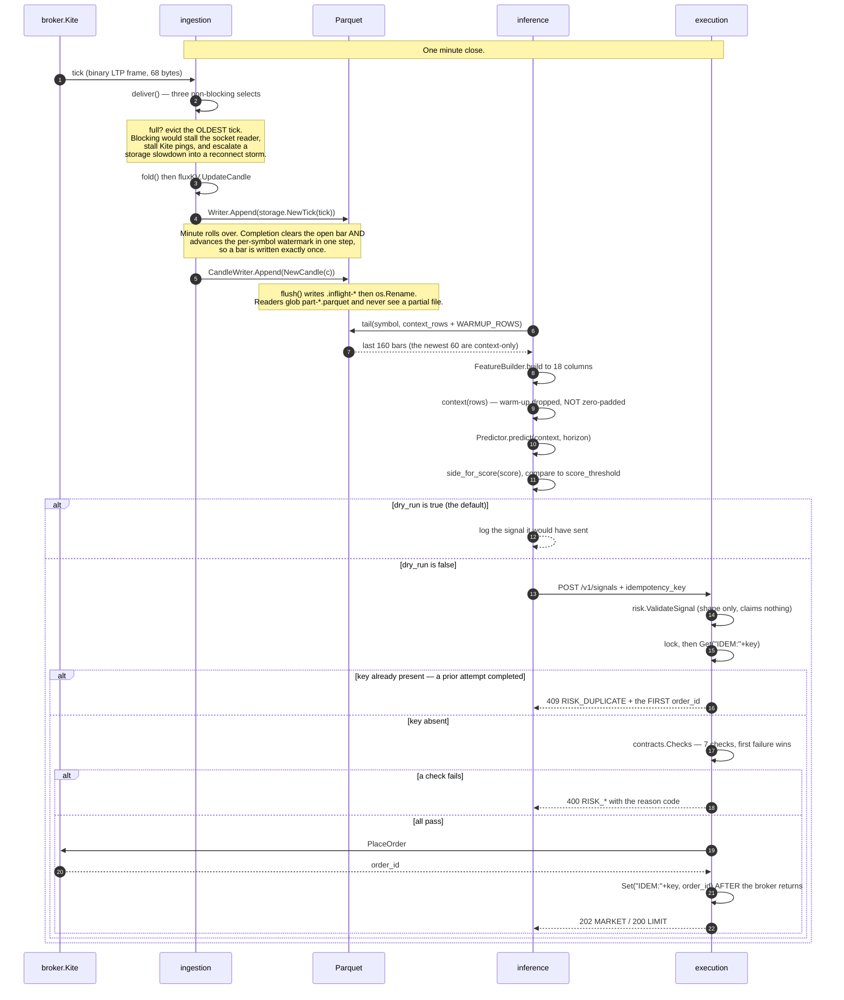
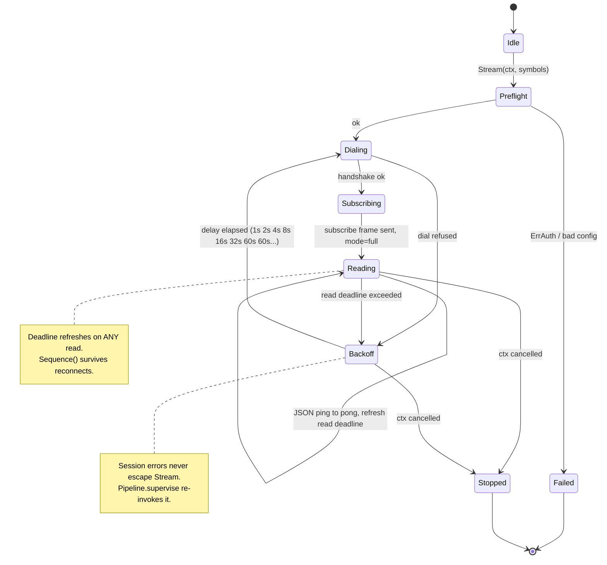

# High-level design (Mermaid)

These render **inline on GitHub** and in any Markdown viewer, with no tooling —
which is the reason to keep them in Mermaid even though the detailed set lives
in D2. `make mermaid` regenerates the `.svg`/`.png` files for anywhere that
cannot render Mermaid natively.

The D2 set in the parent directory carries the component detail. This file is
the read-it-on-GitHub overview.

## The platform

Four services and a shared `core/` Go module, running on one machine. Every
label below names something real: a type, a config key, a file path, an HTTP
route, or a reason code from [`docs/contracts.md`](../contracts.md).



### The one decision that shapes everything

`fluxKV` is an in-memory `map`, and the original code had `ingestion` and
`execution` — separate processes — both reading it. Execution's debounce check
therefore always saw an empty cache, silently.

**`fluxKV` is a per-process cache, never a message bus.** Parquet is the durable
source of truth, and inference *pulls* at each minute close rather than
subscribing. At a 60-second decision cadence push latency buys nothing, and pull
survives a missed minute with no broker and no offset reconciliation. Only two
things cross a process boundary: **HTTP** and **the filesystem**.

## One minute close, end to end

The sequence below is the real order in the code, including the failure paths
and the idempotency handshake.



## WebSocket lifecycle

`Stream` reconnects internally, but it can also **return** — and an unsupervised
return left the service reporting healthy while ingesting nothing. That is why
`Pipeline.supervise` re-invokes it on a second, independent backoff.



Two details that are easy to get wrong and are load-bearing:

- The read deadline is refreshed on **any** read, not only on `pong`, so a
  silent socket is detected rather than waited on indefinitely.
- `Sequence()` is monotonic and does **not** reset across reconnects, which is
  what makes a duplicated or reordered frame detectable after a reconnect.

The backoff uses iterative doubling rather than `2^n` deliberately: a large
attempt count must clamp, not overflow into a hot loop.

## Licensing, because it constrains the architecture

TabFM's **source** is Apache-2.0. The **pretrained weights** are
`tabfm-non-commercial-v1.0` — non-commercial, non-production. A trading platform
is neither.

That is why the model sits behind the `InferenceModel` protocol: the decision has
to be reversible. The same reasoning drives the operational constraint — this
machine has 14GB with the OOM killer active, so CI never loads the weights and
`TabFMModel` is verified against a fake checkpoint. See
[`Plan.md`](../../Plan.md) §5 and §0.

## Rendering

```sh
make mermaid          # .mmd -> .svg and .png
```

`mmdc` 12.0.0 plus `google-chrome`. The D2 equivalent is `make diagrams`.
